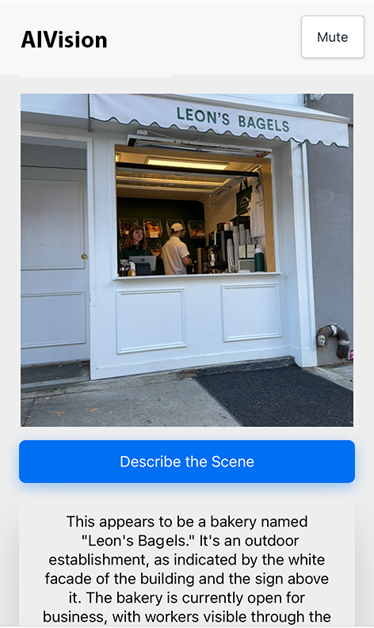
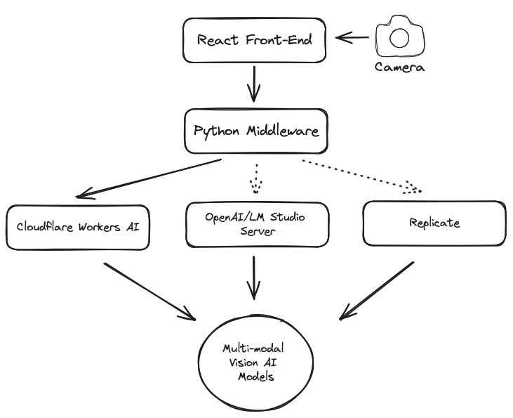

# Overview

AIVision narrates day-to-day experiences for its users, describing what is around them in near real-time with a human voice. Because AIVision uses a powerful multi-modal AI model, it can cope with wide range of situations. The fundamental aspect that sets modern AI models apart is their ability to generalize. That is, it doesn't need to be trained on every specific circumstance or object, it is able to generalize and reason about new information. 

It takes a snapshot through the back camera of the device and narrates what it sees via on-device text-to-speech API.

AIVision is designed for speed and simplicity. In order to offer the most accessible experience the app is fully browser based, relying on standard browser APIs for camera access and text-to-speech generation. It works on any phone or device and does not require an app to be installed.

## Overview
AIVision is comprised of a React front-end and Python middleware that can access several different AI providers.

## Front-end
Run `npm run start` or `npm run build`.

## Middleware
Use Waitress to run the application `waitress-serve --port 5000 --call "app:create_app"`

### Cloudflare Workers AI (Default)

Cloudflare Workers AI is a platform that allows you to run LLM workers with a large selection of models available.

For AIVision we are using `@cf/unum/uform-gen2-qwen-500m` text-to-image model. It provides good speed and accuracy.

AIVision uses Cloudflare AI Gateway to observe and control access to the model.

### LM Studio Server/OpenAI API
Communicates with a local instance of [LM Studio](https://lmstudio.ai/). Tested with `llava-v1.6-mistral-7b.Q3_K_M.gguf`.

This interface can be used with any OpenAI compatible API endpoint.

### Replicate
Tested with `yorickvp/llava-13b`.
[Replicate](https://replicate.com/yorickvp/llava-13b)